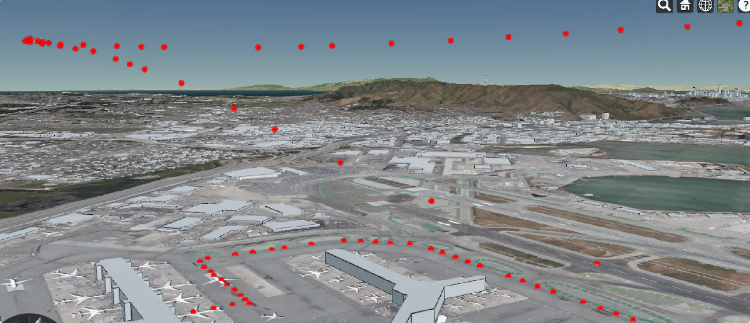

# Live Flight Tracker #  
---

# Project Description #

This project builds on the [CesiumJS](https://cesium.com/platform/cesiumjs/) platform to deliver a 3D modeling of historical data and live flight paths. I've collected geospatial data from aircrafts with a paid subscription to [Flightradar24](https://www.flightradar24.com/).

From the [CesiumJS GitHub](https://github.com/CesiumGS/cesium) - "CesiumJS is a JavaScript library for creating 3D globes and 2D maps in a web browser without a plugin. It uses WebGL for hardware-accelerated graphics, and is cross-platform, cross-browser, and tuned for dynamic-data visualization."

# How to use Flight Tracker #

### Todo
- [ ] Increase start-up speed by only loading necessary Cesium dependencies  
- [ ] Upload demonstration screenshots/GIFs to GitHub   
- [ ] Load 3D Model
- [ ] Add project credits
- [ ] Figure out how to live-load flight data or simulate live-loading by incrementally retrieving data from .csv
- [ ] Write user instructions

### In Progress
- [ ] Use Python to convert .csv files with flight data to .czml files
- [ ] Write Project Description

### Done ✓
- [x] Start CesiumJs Viewer on localhost:8080
- [x] Load example scenarios from .czml files
- [x] Visualize flight path from example scenario
