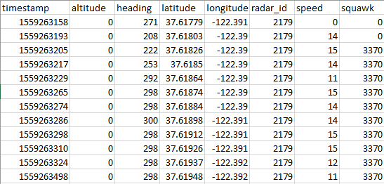

# Live Flight Tracker #  
---


# Project Description #

This project builds on the [CesiumJS](https://cesium.com/platform/cesiumjs/) platform to deliver a 3D modeling of historical data and live flight paths. I've collected geospatial data from aircrafts with a paid subscription to [Flightradar24](https://www.flightradar24.com/). The data, as shown below, is exported from .csv files containing altitude, heading, latitude, longitude, speed, as well as an Epoch timestamp at the time of measurement. I used Python (TODO: "and associated libraries") to convert data into [CZML](https://github.com/AnalyticalGraphicsInc/czml-writer/wiki/CZML-Guide), a JSON schema for describing dynamic scenes in virtual globes & maps. 



From the [CesiumJS GitHub](https://github.com/CesiumGS/cesium) - "CesiumJS is a JavaScript library for creating 3D globes and 2D maps in a web browser without a plugin. It uses WebGL for hardware-accelerated graphics, and is cross-platform, cross-browser, and tuned for dynamic-data visualization."

---
# How to use Flight Tracker #
Clone this repository
- Open Git Bash or Terminal
- Change the current working directory to the location where you want the cloned directory.
```bash
git clone https://github.com/idkburkes/Flight-Tracker.git
```
You must have [Node.js](https://nodejs.org/en/) installed in order to use the [Node Package Manager](https://www.npmjs.com/) to install necessary project dependencies and run the start script. 

```bash
npm install 
npm run start
```
---
### Node Dependencies
- [cesium](https://www.npmjs.com/package/cesium)
- [webpack-dev-server](https://www.npmjs.com/package/webpack-dev-server)
- [webpack-cli](https://www.npmjs.com/package/webpack-cli)
- [webpack](https://www.npmjs.com/package/webpack)
- [html-webpack-plugin](https://www.npmjs.com/package/html-webpack-plugin)
- [copy-webpack-plugin](https://www.npmjs.com/package/copy-webpack-plugin)
- [file-loader](https://www.npmjs.com/package/file-loader)
- [style-loader](https://www.npmjs.com/package/style-loader)
- [css-loader](https://www.npmjs.com/package/css-loader)
- [url-loader](https://www.npmjs.com/package/url-loader)


### Todo
- [ ] Increase start-up speed by only loading necessary Cesium dependencies  
- [ ] Upload demonstration screenshots/GIFs to GitHub   
- [ ] Load 3D Model
- [ ] Add project credits
- [ ] Figure out how to live-load flight data or simulate live-loading by incrementally retrieving data from .csv


### In Progress
- [ ] Use Python to convert .csv files with flight data to .czml files
- [ ] Write Project Description
- [ ] Write user instructions

### Done ✓
- [x] Start CesiumJs Viewer on localhost:8080
- [x] Load example scenarios from .czml files
- [x] Visualize flight path from example scenario
